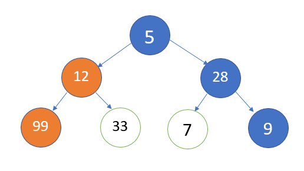

# Greedy Algorithm
A greedy algorithm is an algorithmic strategy that makes the best optimal choice at each small stage with the goal of this eventually leading to a globally optimum solution. This means that the algorithm picks the best solution at the moment without regard for consequences. It picks the best immediate output, but does not consider the big picture, hence it is considered greedy.
# How does it works
A greedy algorithm works by choosing the best possible answer in each step and then moving on to the next step until it reaches the end, without regard for the overall solution. It only hopes that the path it takes is the globally optimum one, but as proven time and again, this method does not often come up with a globally optimum solution. In fact, it is entirely possible that the most optimal short-term solutions lead to the worst possible global outcome.

Think of it as taking a lot of shortcuts in a manufacturing business: in the short term large amounts are saved in manufacturing cost, but this eventually leads to downfall since quality is compromised, resulting in product returns and low sales as customers become acquainted with the “cheap” product. But this is not always the case, there are a lot of applications where the greedy algorithm works best to find or approximate the globally optimum solution such as in constructing a Huffman tree or a decision learning tree.
For example: Take the path with the largest sum overall. A greedy algorithm would take the blue path, as a result of shortsightedness, rather than the orange path, which yields the largest sum.

<<<<<<< HEAD

Components:

- A candidate set of data that needs a solution
- A selection function that chooses the best contributor to the final solution
- A feasibility function that aids the selection function by determining if a candidate can be a contributor to the solution
- An objective function that assigns a value to a partial solution
- A solution function that indicates that the optimum solution has been discovered
=======
Components:

A candidate set of data that needs a solution
A selection function that chooses the best contributor to the final solution
A feasibility function that aids the selection function by determining if a candidate can be a contributor to the solution
An objective function that assigns a value to a partial solution
A solution function that indicates that the optimum solution has been discovered
>>>>>>> 965dd3ffa643e2b3d4cdab3511a1a889ec0f97ac
